# Maze Game Testing

I have done two types of testing manual and validator tests.  For the manual testing I have put together a test document in excel. It details all the steps taken to test the user stories. As i have yet to work out how to get Excel and Github to talk properly.  I have included screen shots of the testing done.

-   ## User stories
    The following steps were taken to test the user stories

    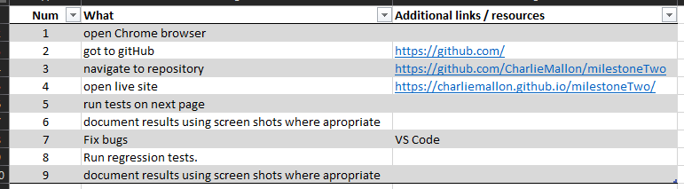
    ### User Story 1

    | User story | Acceptance Criteria | Description |
    | --- | --- | --- |
    |As a user, I want to play an interactive game.| The hero character should be moveable. There should be rules for the environment.  There should be multiple game maps. | The character will be able to move using buttons or keys. The character will not be able to walk off the edge of the map or through the Maze walls. There will be at least two maze maps, with a clear exit on each map.|

    #### Testing & Results
    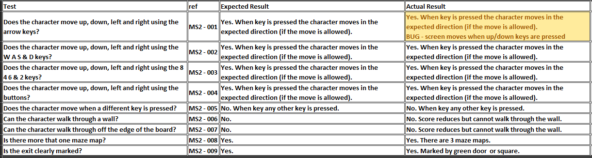

    #### User Story 2
    | User story | Acceptance Criteria | Description |
    | --- | --- | --- |
    | As a user, I want to know if I have won or lost the game. | There should be a clear end point. It should be clear that the user has won/lost the game. If the user loses / finishes the game there should be an option to re-start. | There will be a clear exit on each map.Modal will be used to tell the user that they have Won or Lost the game. The lose modal will have the option to play again.  When you get to the end a modal will pop up with the option to play again.|

    #### Testing & Results
    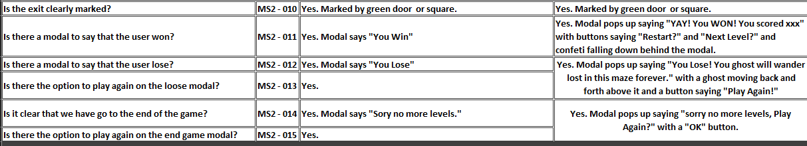
    #### Images
    

    #### User Story 3
    | User story | Acceptance Criteria | Description |
    | --- | --- | --- |
    | As a user, I want to play know how to play the game. | The instruction to play the game should be clear and visible on first playing. The keys should be clearly indicated. Instructions should tell the user how to win the game. The instruction to play the game should be  accessible whist playing. | The instruction will pop up on game start. Instructions will indicate the keys needed to play. The game is won by getting to the exit. The instruction will be accessible using  a 'how to play' link on the game page. |

    #### Testing & Results
    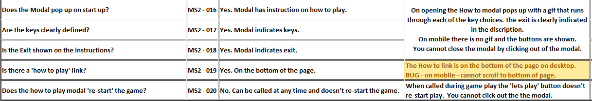
    #### Images
    

    #### User Story 4
    | User story | Acceptance Criteria | Description |
    | --- | --- | --- |
    | As a returning user, I want to get better at the game. | Have a score that takes into account the number of keystrokes used to get to the exit. | The score will be Visible. For each keystroke 5 points will be taken of the starting score of 1,000. If you get to a score of 0 you will lose. For each level you clear 500 points will be added to the score. |

    #### Testing & Results
    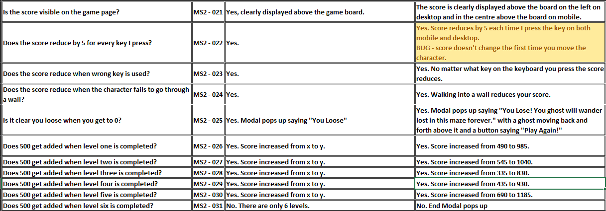
    #### Images
    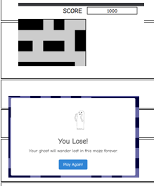

    #### User Story 5
    | User story | Acceptance Criteria | Description |
    | --- | --- | --- |
    | As a user, I want to know more about the developer and see anything else they have been working on. | A short description of the developer of this game. A way to see any other projects. A way to get in touch. | This will be achieved with an about the developer page. Which will have a short description of the developer and why this site was created. It will also have a link to the developers gitHub page where more up-to-date information will be displayed. It is not intended that this will be updated regularly so the information will be generic. There will be a contact form that uses the JS email service to get in touch with the developer. |

    #### Testing & Results
    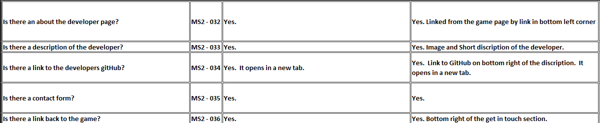
    #### Images
    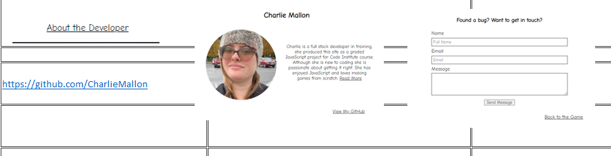

    #### User Story 6
    | User story | Acceptance Criteria | Description |
    | --- | --- | --- |
    | As a user, I want give feedback on this game. | A way to send an email to the developer. To be alerted when the email has sent or failed to send. Validation on the boxes to ensure that all relevant boxes are filed in. Validation on the email address to say an email has been inputted. | This will be achieved using a contact form and the JS email service. With a pop up modal to tell the user that the message has been sent or failed to send. The required attribute will be added to each of the required boxes. The email attribute will be added to the email box. This will ensure the user is alerted if any of the information is incorrect or incomplete.|

    #### Testing & Results
    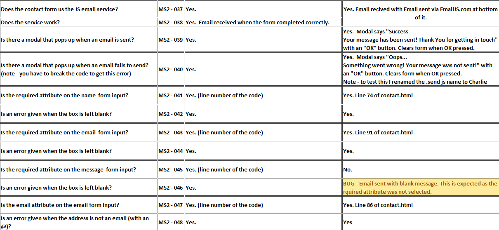
    #### Images
    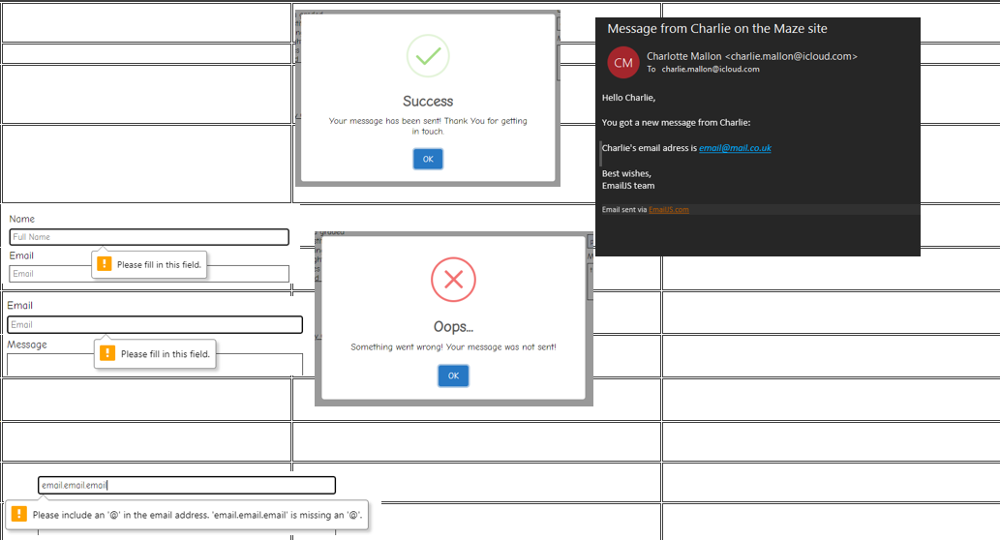

    #### User Story 7
    | User story | Acceptance Criteria | Description |
    | --- | --- | --- |
    | As a user, I want to view the website and content clearly on any device | Website layout is well displayed and readable across all sized devices and different orientations. |Flexbox will be used to lay the content of the website. Mobile first design will be used when coding the project and testing will be required to ensure the layout is clear on all devices. No elements should overlap their containers and all items should be responsive. Where practical the game board should be displayed on one screen (ie no scrolling). |

    #### Testing & Results
    For this one i took screen shots over different screen sizes and orientations
    #### Images
    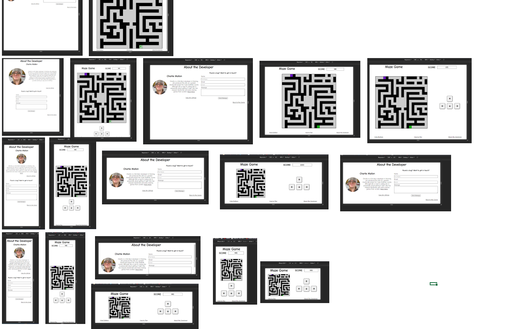

-   ## User stories Bug Summary
    Four bugs were found whilst testing the user stories.  As some of these bugs have been fixed regression testing had to be done.

    | Test Ref  | Test Description  | Bug Description | final fix | comment |
    | --------- | ----------------- | ----------------| --------- | ------- |
    | MS2-001 | Does the character move up, down, left and right using the arrow keys? | screen moves when up/down keys are pressed                 | Re-layed out the page so that it fits on one screen.                                                                                                         | Regression testing required re-do all layout tests MS2-049 through to MS2-056                                    |
    | MS2-019 | Is there a 'how to play' link?                                         | on mobile - cannot scroll to bottom of page                | Body had touch events set to none. This was to remove the double tap zoom. Changed it to only allow scrolling. Also set the game board to touch-events none. | Regression testing re-do MS2-004, on tablet or phone - check for double tab.                                     |
    | MS2-022 | Does the score reduce by 5 for every key I press?                      | score doesn't change the first time you move the character | Not fixing                                                                                                                                                   | This is a game quirk that I have decided to keep as it is a gesture of good will to allow the 1st move for free. |
    | MS2-046 | Is an error given when the box is left blank?                          | Email sent with blank message                              | Added required attribute to the message box.                                                                                                                 | Regression testing re-do MS2-045 & MS2-046.                                                                      |

-   ## User stories Regression Testing

    For the areas identified in the bug summary the following test were done.

    #### Testing & Results
    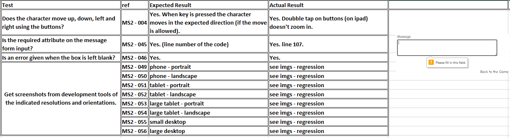
    #### Images
    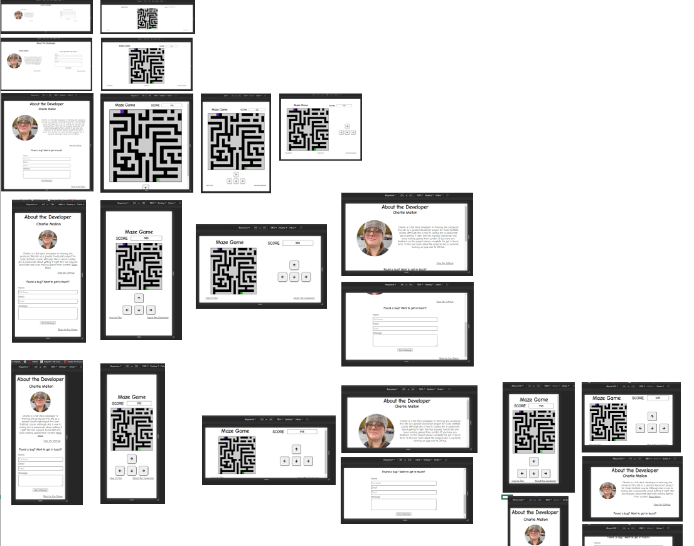

-   ## Validators

    ### HTML
    I used the [W3C HTML Validator](https://validator.w3.org/#validate_by_input) to validate my HTML

    #### Output Maze
    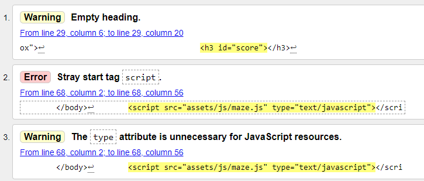

    #### Comments Maze
    1.  Score is inputted by the JS.  This is not really an issue but i have fixed it by putting a starting score of 0.
    2.  Script is outside the body.  Moved into the Body.
    3.  No action needs to be taken.

    #### Output About
    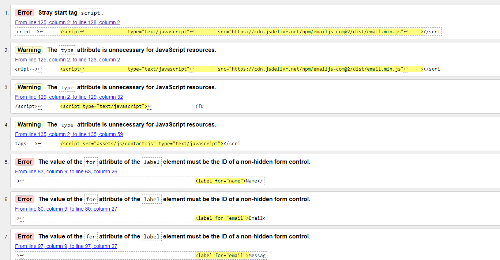

    #### Comments About
    1.  Script is outside the body.  Moved into the Body.
    2.  Removed Type attribute as no longer needed (2-4).
    5.  Updated the for attributes to reflect the id's (5-7).

    ## CSS
    I used the [W3C CSS Validator](https://jigsaw.w3.org/css-validator/#validate_by_input) to validate my CSS no errors were found.

    ## JS
    I used [jshint](https://jshint.com/) to validate my JS
    
    #### Output Maze
    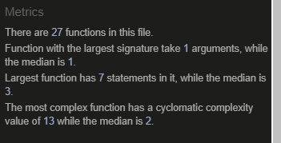

    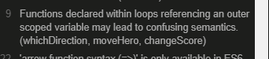

    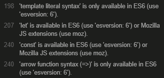

    #### Comments Maze
    1.  The warning on line 9 is suggesting that the const should be pulled into the for loop however the for loop needs this to be outside, so this will be disregarded.
    2.  The other warnings are telling me that there some of the JS syntax is not supported on older browsers. These are advisory and so will be disregarded.

    #### Output About
    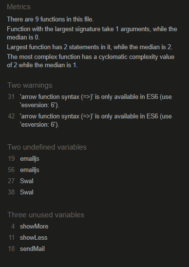

    #### Comments About
    1.  The warnings are not something that needs fixing.